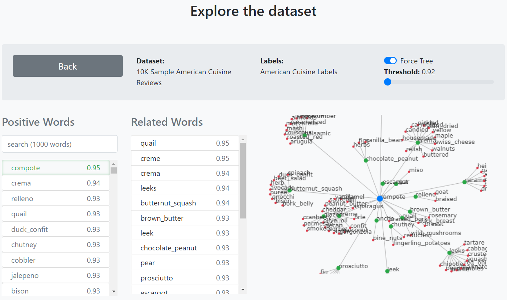
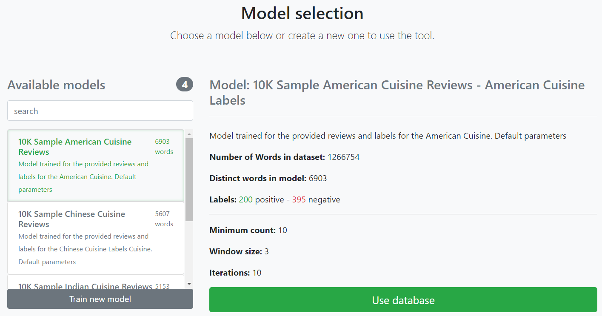
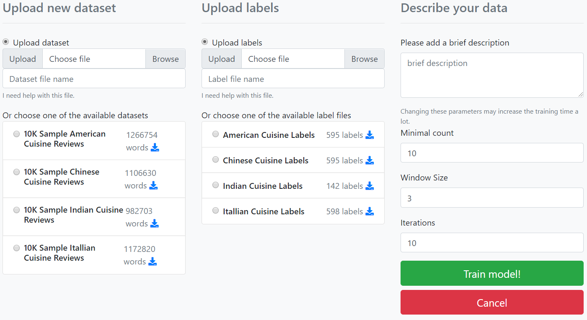
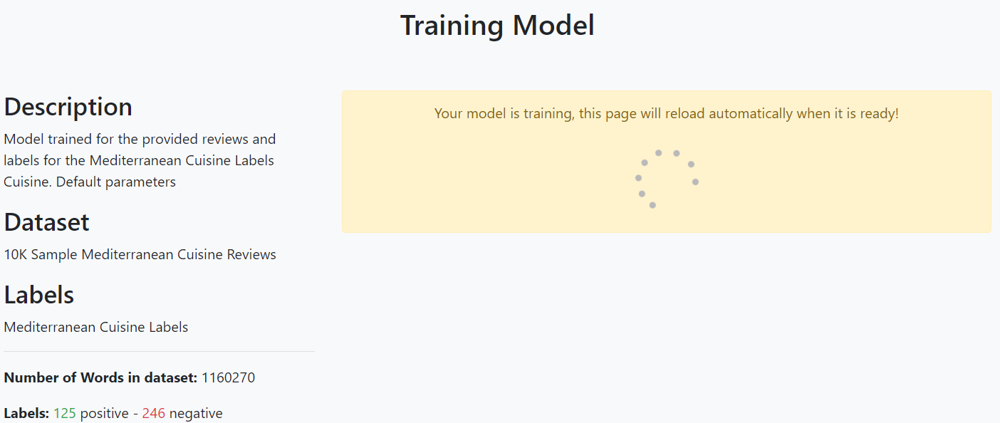

# CS598-T7
This is a repository for the Web System developed for Task 7 in CS598 - Data Mining Capstone for the [MCS-DS at UIUC](https://cs.illinois.edu/academics/graduate/professional-master-computer-science/online-master-computer-science-data-science)

The systems let the user traing and explore Word2Vec models, for more information read [the report](https://github.com/serdasteclas/CS598-T7/blob/master/report/report.pdf).

